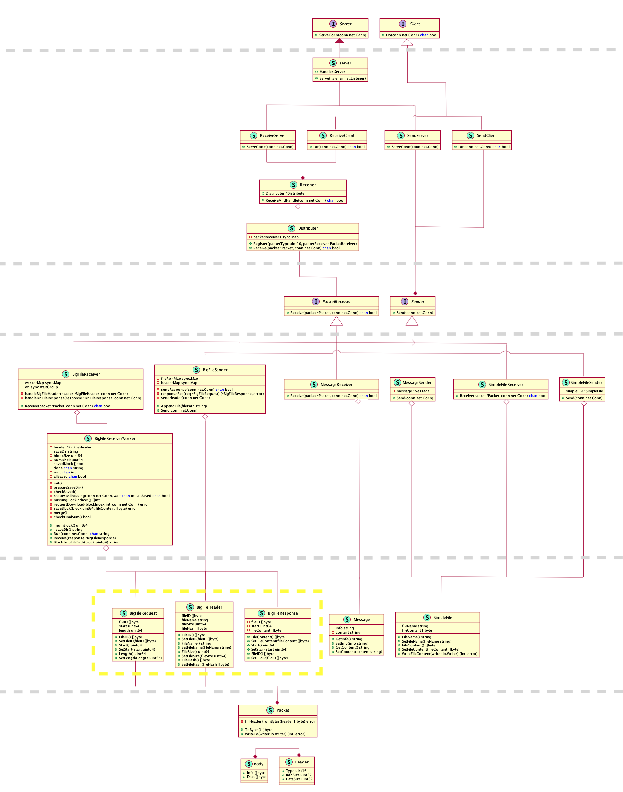

# Gofer

Gofer (GOfer Files Express Receiver) is a file transporter written in Golang.

It's now just a toy, do not take it seriously. You are expected to use something like scp or, better, rsync in the real world.

## Build

You should build it by yourself, to get an unique set of TLS certificates (to protect the security of file transporting).

```sh
$ sh static/certs/generate_cert.sh
$ go build -o gofer.out ./cmd/main.go
```

## Usage

```sh
gofer <send|recv> [-f=FILE] [-m=MESSAGE [-i INFO]] <-s|-c>=ADDRESS
 send: send things
 recv: receive things.
  -bigfile BiG_FILE
    	path of BiG_FILE to send (Only for <gofer send>)
  -c ADDRESS
    	run as a client, connect to a server at given ADDRESS
  -f FILE
    	path of FILE to send (Only for <gofer send>)
  -i INFO
    	INFO of message to send. (use with <gofer send -m>)
  -m MESSAGE
    	MESSAGE to send. (Only for <gofer send>)
  -s ADDRESS
    	start a server at given ADDRESS
```

## Example

### Sender as server

- send message

```sh
tty01 $ gofer send -m Hello -i World -s 0.0.0.0:2333
```

```sh
tty02 $ gofer recv -c <IPv4|IPv6>:2333
```

- send simple file

```sh
tty01 $ gofer send -f <FILE> -s 0.0.0.0:2333
```

```sh
tty02 $ gofer recv -c <IP>:2333

```

### Receiver as server

```sh
tty01 $ gofer recv -s 0.0.0.0:2333
```

```sh
tty02 $ gofer send -m Hello -i World -c <IP>:2333
tty02 $ gofer send -f <FILE> -c <IP>:2333
```

### Big File

```sh
sender $ gofer send -bigfile <FILE> -c <HOST>:2333
```

```sh
recver $ gofer recv -s :2333
```

## Implement



## License

Licensed under the MIT License.

Copyright 2020 CDFMLR. All rights reserved.
