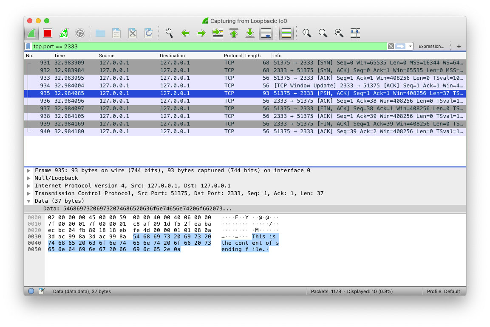

## 文件传输

### 基本实现

最简单的文件传输十分容易实现：

- 发送端读取本地文件，建立 TCP 连接，向 TCP 连接中传输文件数据；
- 接收端监听服务，接收发送端的连接，从连接中读取数据，写入文件。

上述过程的 Go 语言实现：

```go
// SendFile 建立与 receiver 的 TCP 发送 srcFilePath 文件的内容
// receiverAddr 是收件人的地址, e.g. 127.0.0.1:2333
func SendFile(srcFilePath string, receiverAddr string) (sent int64, err error) {
	file, err := os.Open(srcFilePath)
	if err != nil {
		return 0, err
	}
	defer file.Close()

	conn, err := net.Dial("tcp", receiverAddr)
	if err != nil {
		return 0, err
	}
    defer conn.Close()

	fmt.Println("Receiver connected. Sending...")

	return io.Copy(conn, file)
}
```

```go
// ReceiveFile 监听指定地址 address, 从中接收文件保存到 dstFilePath
// address 是要监听的地址, e.g. 127.0.0.1:2333
func ReceiveFile(dstFilePath string, address string) (received int64, err error) {
	file, err := os.OpenFile(dstFilePath,
		os.O_WRONLY|os.O_TRUNC|os.O_CREATE, 0666)
	if err != nil {
		return 0, err
	}
	defer file.Close()

	listener, err := net.Listen("tcp", address)
	if err != nil {
		return 0, err
	}
    defer listener.Close()

	fmt.Println("Waiting for sender...")
    
	conn, err := listener.Accept()
	if err != nil {
		return 0, err
	}
    defer conn.Close()

	fmt.Println("Sender connected. Receiving...")
    
	return io.Copy(file, conn)
}
```

```go
// 命令行接口
func main() {
	if len(os.Args) < 4 {
		usage()
		return
	}

	cmd := os.Args[1]
	path := os.Args[2]
	addr := os.Args[3]

	switch cmd {
	case "send":
		if n, err := SendFile(path, addr); err != nil {
			fmt.Println("SendFile failed:", err)
		} else {
			fmt.Println("Sent successfully:", n)
		}
	case "recv":
		if n, err := ReceiveFile(path, addr); err != nil {
			fmt.Println("ReceiveFile failed:", err)
		} else {
			fmt.Println("ReceiveFile success:", n)
		}
	default:
		usage()
	}
}

func usage() {
	fmt.Println("usage: gofer <send|recv> FILE ADDRESS")
}
```

运行时，先启动接收端，再启动发送端：

- 接收端

```sh
$ go run simple_ft.go recv ./a.md :2333
Waiting for sender...
Sender connected. Receiving...
ReceiveFile success: 10907
```

- 发送端

```sh
$ go run simple_ft.go send ~/Desktop/DNS.md :2333
Receiver connected. Sending...
Sent successfully: 10907
```

### 一点改进

#### 基本实现的问题

上面那样的简单的实现局限性很大，在现实中基本不可用。因为它有一些比较突出的问题：

1. 大文件传输困难。大文件在传输过程中，很难保证一次传完，这样就需要断点续传的功能。
2. 有时我们希望“广播”发送文件，即然一台服务器发，多台客户端进行文件接收。而上面的简单实现不支持这种操作。
3. 明文传输不安全。随便抓包就可以获取传输的文件内容：




#### 改进方案

因此，我们可以对代码做一点改进：

- 传输时使用 SSL/TLS 协议，加密传输，保证安全性。
- 让收/发双方都支持以客户端/服务端模式运行。
- 设计一套协议支持大文件的并发传输、断点续传。

前两点都容易实现，不作详细说明。关于最后一点，我设计的大文件传输方案是让「发送端」先把文件信息给「接收端」，其中包含文件大小，然后由「接收端」一段一段地请求下载，最后合成一个文件。这个过程需要如下数据结构:

- BigFileSender：发大文件用的东西
- BigFileReceiver：收大文件用的东西

- BigFileHeader： Sender 发给 Receiver 的文件信息说明。
- BigFileRequest： Receiver 发给 Sender 的文件片段下载请求。
- BigFileResponse： Sender 发给 Receiver 的文件片段。

然后发送大文件的流程就可以更具体地描述为:

1. BigFileSender 读取大文件信息，构建 BigFileHeader
2. BigFileSender 把 BigFileHeader 发给 BigFileReceiver
3. BigFileReceiver 发送 BigFileRequest 给 BigFileSender，请求下载一段文件
4. BigFileSender 把请求的文件段写入 BigFileResponse 发给 BigFileReceiver
5. BigFileReceiver 把 BigFileResponse 收到的文件部分写入磁盘
6. 重复 3~5, 直到 BigFileReceiver 接收到全部文件部分, 然后合并、校验文件。
7. BigFileReceiver 回传 BigFileHeader 给 BigFileSender，表示接收完成。

在细节上，为了能同时接收多个大文件，把 BigFileReceiver 实现为 BigFileReceiver + BigFileReceiverWorker 两个类，以 Master-Worker 模式完成工作。

#### 具体实现

为了实现上面设计的方案，就需要收发并处理不同类型的数据包。这里把这种自定义的数据包（协议）称为 Packet。 Packet 主要由两部分数据组成: Header 和 Body：

- Header 是固定长度的描述区域，包含:
   - Type 描述数据的类型, 例如 2 表示消息, 3 表示文件
   - InfoSize 和 DataSize, 描述 Info 和 Data 的长度 (in Bytes)
- Body 是长度不确定的数据区域，包含:
   - Info 是数据的特定信息, 例如 Type 为文件时, Info 可能就是文件名
   - Data 即主体数据, 例如消息内容、文件内容...

```
 -------------------------------------------------------
|    |             Header             |       Body      |
|----+--------------------------------+-----------------|
|PART|Type|InfoSize|DataSize|RESERVED*|  Info  |  Data  |
|----+----+--------+--------+---------+--------+--------|
|SIZE| 2B |   4B   |   4B   |   2B    |InfoSize|DataSize|
 -------------------------------------------------------

 * RESERVED: 保留字段, 暂时没用. 只是让 Header 对齐到 8/2 的整数倍。
```

BigFileHeader、BigFileRequest、BigFileResponse 就都可以继承自 Packet，在 Info、Data 中放入按需要放入信息即可。

同时，还可以顺便实现一些其他类型的 Packet，比如：

- Message：表示一条消息，接收端收到后直接打印到屏幕。
- SimpleFile：如同之前的基本实现一样，简单地直接传输小文件。

然后，我们为每一种 Packet 实现特定的发送器、接收器，分别实现 PacketReceiver、Sender 接口。之后程序就调用这些东西完成特定 Packet 的处理、收发。

由于这里有好多种不同的 Packet，所以需要一个 Receiver 统一接收，然后交给 Distributer 按照收到的消息的 Type 分发给各种 Packet 的 PacketReceiver 处理。

最后，依照一个 Server、Client 接口，实现发送/接收的服务、客户端。

具体的实现代码比较多，不方便直接贴出。下面给出整体实现的类图：


完整的代码实现在 MIT 协议下开放源代码：

- [https://github.com/cdfmlr/gofer](https://github.com/cdfmlr/gofer)
- https://gitee.com/cdfmlr/gofer

未尽之处请查看源码，其中包含详细注释。

#### 运行结果

最终实现的命令行接口：

```sh
gofer <send|recv> [-f=FILE] [-m=MESSAGE [-i INFO]] <-s|-c>=ADDRESS
 send: send things
 recv: receive things.
  -bigfile BiG_FILE
    	path of BiG_FILE to send (Only for <gofer send>)
  -c ADDRESS
    	run as a client, connect to a server at given ADDRESS
  -f FILE
    	path of FILE to send (Only for <gofer send>)
  -i INFO
    	INFO of message to send. (use with <gofer send -m>)
  -m MESSAGE
    	MESSAGE to send. (Only for <gofer send>)
  -s ADDRESS
    	start a server at given ADDRESS
```

发送端作为服务器的运行结果：


接收端作为服务器的运行结果：


抓包可以看到数据是加密安全传输的：


大文件收发：


